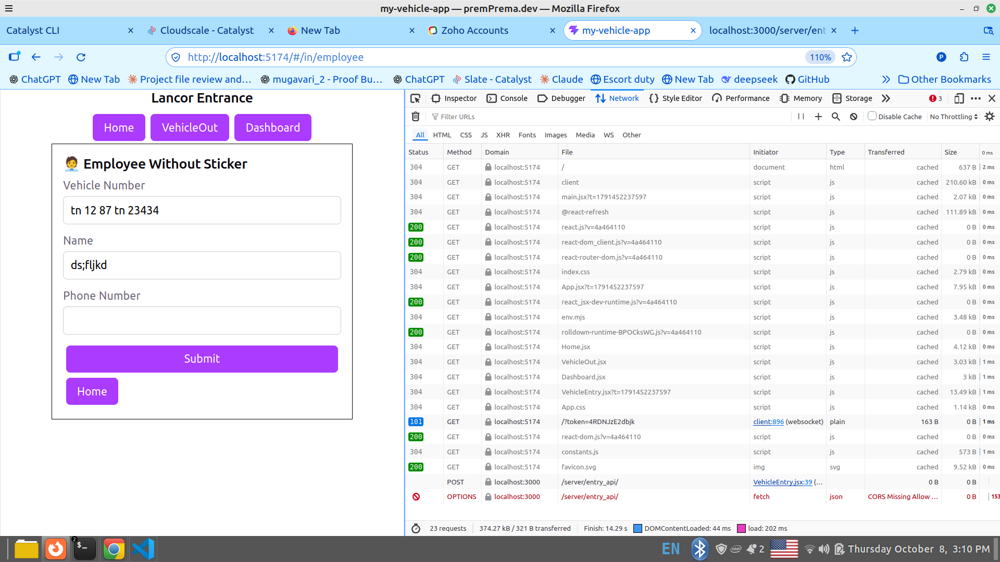

# 🚫 CORS Error (Notes)

Date: 2026-10-08
Where: 5.5 — React VehicleEntry form → `fetch` POST → `entry_api`

---

## 📸 En screenshot



Kadaisi 2 rows paaru:

| Row | Method | Domain | Transferred | Artham |
|---|---|---|---|---|
| ① | 🚫 **OPTIONS** (red) | localhost:3000 | **CORS Missing Allow …** | Browser mudhalla "permission kidaikkumaa?" nu kettadhu → **block** |
| ② | **POST** | localhost:3000 | 0 B | Permission kidaikkaadhaala **real POST poagave illa** ❌ |

Matha rows ellam `localhost:5174` — React page oda files (js, css). Avanga problem illa.

---

## ❓ CORS na enna?

**CORS = Cross-Origin Resource Sharing.** Browser-oda **security rule**:

> Oru page **vera address-ku** data anuppa, andha address **"aamaa, unakku permission irukku"** nu sollanum.

| | Address (origin) |
|---|---|
| 🏠 En React page | `http://localhost:5174` |
| 👨‍🍳 En kitchen (`catalyst serve`) | `http://localhost:3000` |
| Same ah? | ❌ **Port vera → vera origin** |

**Origin = protocol + host + port.** Moonula onnu vera aanaalum vera origin.

---

## 💂 Hotel story

Kitchen kadhavu la oru **security guard** (browser) 💂:
"Endha dining hall la irundhu varra? Andha hall-ku kitchen **permission letter** kuduthirukkaa?"
Letter illana **order-a ulla vidamaattaar**.

```
🏠 React (5174)                      💂 Browser            👨‍🍳 Kitchen (3000)
   │ "POST pannanum"                     │
   ├────── ① OPTIONS: "permission?" ────▶│──────────────────▶ 200 rows… (letter illa ❌)
   │                                     │ 🚫 BLOCK
   ✗ ② POST anuppave illa
```

---

## 🔍 OPTIONS request la enna kettadhu (Request Headers)

```
Origin: http://localhost:5174                      ← "naan 5174 la irundhu varen"
Access-Control-Request-Method: POST                ← "POST panna permission kidaikkumaa?"
Access-Control-Request-Headers: content-type       ← "JSON label oda?"
```

**Response Headers** la `Access-Control-Allow-Origin` **illa** → kitchen "sari" nu sollala → 🚫

Idhu per: **preflight** (munnaadi oru check). `Content-Type: application/json` oda POST panna, browser **thaana** mudhalla OPTIONS anuppum.

---

## ❓ Yen indha rule?

Illana, yaaro oru **kettavan website** un browser la irundhu un bank-ku / un app-ku **un login-oda** request anuppalaam 😱 Browser adha thadukkudhu.

## ❓ curl la yen varala?

CORS **browser** mattum dhaan check pannum. curl browser illa — guard illa 😄

| Tool | CORS check? |
|---|---|
| Browser (`fetch`) | ✅ Aamaa — guard 💂 |
| curl | ❌ Illa |

---

## 🛠️ Fix (kitchen permission letter kudukkanum)

| # | Enna | Hotel la |
|---|---|---|
| 1 | Response la `Access-Control-Allow-…` **headers** | Permission letter ✉️ |
| 2 | **OPTIONS** vandhaa udane **204** (OK, body illa) | Guard kelvi-ku "sari, vaa" nu mattum sollu |
| 3 | **localhost** mattum allow (local dev) | Namma dining hall-ku mattum letter |

💡 Reference app la idhu `setLocalDevCors` (`vendor_entries/index.js`).

💡 React **5174** la odudhu (5173 vera yaaro use pannuraanga) — so fix **endha localhost port aanaalum** allow pannanum.

### ✅ Fix code (Part A — helper, `getBody` maadhiri)

```js
function allowLocalhost(req, res) {
	const origin = req.headers.origin || '';
	if (origin.startsWith('http://localhost:')) {
		res.setHeader('Access-Control-Allow-Origin', origin);
		res.setHeader('Access-Control-Allow-Methods', 'GET,POST,OPTIONS');
		res.setHeader('Access-Control-Allow-Headers', 'Content-Type');
	}
}
```

| Line | Artham | Hotel la |
|---|---|---|
| `req.headers.origin` | Browser thaana podura `Origin` header | Order slip mela "Hall: 5174" stamp |
| `\|\| ''` | Origin illana (curl) kaali text — crash aagaama | Stamp illaadha slip |
| `startsWith('http://localhost:')` | localhost endha port aanaalum allow | Namma dining hall mattum |
| 3 `setHeader` | Permission letter ✉️ | |

**OPTIONS kettadhu ↔ naama kudukkura badhil:**

| OPTIONS Request | Response |
|---|---|
| `Origin: http://localhost:5174` | `Access-Control-Allow-Origin: http://localhost:5174` |
| `Access-Control-Request-Method: POST` | `Access-Control-Allow-Methods: GET,POST,OPTIONS` |
| `Access-Control-Request-Headers: content-type` | `Access-Control-Allow-Headers: Content-Type` |

### ✅ Fix code (Part B — cook mudhal lines)

```js
module.exports = async (req, res) => {
	allowLocalhost(req, res);          // ✉️ ellaa response-kkum letter

	if (req.method === 'OPTIONS') {    // 💂 guard kelvi
		res.writeHead(204);             // "Sari, vaa" — body illa
		res.end();
		return;                         // 🛑 table code odakoodaadhu
	}
	...
```

**Order:** ① letter → ② OPTIONS na 204 + stop → ③ initialize, table → ④ POST → ⑤ GET

### 🧪 Test result

```
HTTP/1.1 204 No Content
access-control-allow-origin: http://localhost:5174
access-control-allow-methods: GET,POST,OPTIONS
access-control-allow-headers: Content-Type
```

Munnaadi OPTIONS: 200 + rows, letter illa 🚫 → Ippo: **204 + letter** ✅ → POST pogudhu → row save 🎉

---

## ❓ En doubts (Q & A)

**Q: `|| ''` enna?**
`||` = OR — left side falsy (`undefined`) na right side (`''`). Ex 3 ternary short form:
`req.headers.origin ? req.headers.origin : ''`
Illana curl la `undefined.startsWith` → 💥 TypeError.

**Q: Origin illana address theriyaadhe, enna pannuradhu?**
Browser **vera address-ku** request anuppum bodhu **eppavume** `Origin` podum. Origin illana → browser illa (curl / server) → guard illa → letter thevai illa, normal ah process.
⚠️ **CORS security illa!** curl la yaar venumnaalum anuppalaam. Real protection = **Login / Auth** 🔐 (Phase 8).

**Q: `allowLocalhost` eppadi connect aagudhu? `req, res` form la irundhu varudhaa?**
Cook mudhal line la `allowLocalhost(req, res)` — `catalyst serve` kudutha **adhe** `req, res`.

```
📝 req
├── 🏷️ HEADERS — Origin (browser thaana), Content-Type (un fetch)   ← allowLocalhost padikkum
└── 📦 BODY    — {"vehicleNumber":…} (un form, JSON.stringify)        ← getBody padikkum
```

---

## 🐛 Naan fix panna CORS bugs

| Line | Bug | Error | Fix |
|---|---|---|---|
| 26 | `req.header.origin` | `TypeError: Cannot read properties of undefined` | `req.headers` (plural) |
| 27 | `origin.startWith(…)` | `TypeError: startWith is not a function` | `startsWith` |
| 29–30 | `Allow-methods`, `Allow-headers` | (work aagum — header names case paakkaadhu) | `Methods`, `Headers` (style) |

---

## 🧩 Inniku 5.5 la kathukitta related bugs

| Bug | Kaaranam | Clue |
|---|---|---|
| "added" vandhuchu, row illa, 200 | `import.meta.VITE_API_BASE` (`.env` missing) → `fetch(undefined)` → `5174/undefined` → Vite 200 | Network la **Request URL** paaru |
| Error vandhaalum "added" | `return` / ok check order thappu | ESLint `Unreachable code` |
| `catalyst serve` 3001 / 3002 | Port 3000 la vera project serve (Daily-Learning-Tracker) | `ss -ltnp \| grep 3000` |
